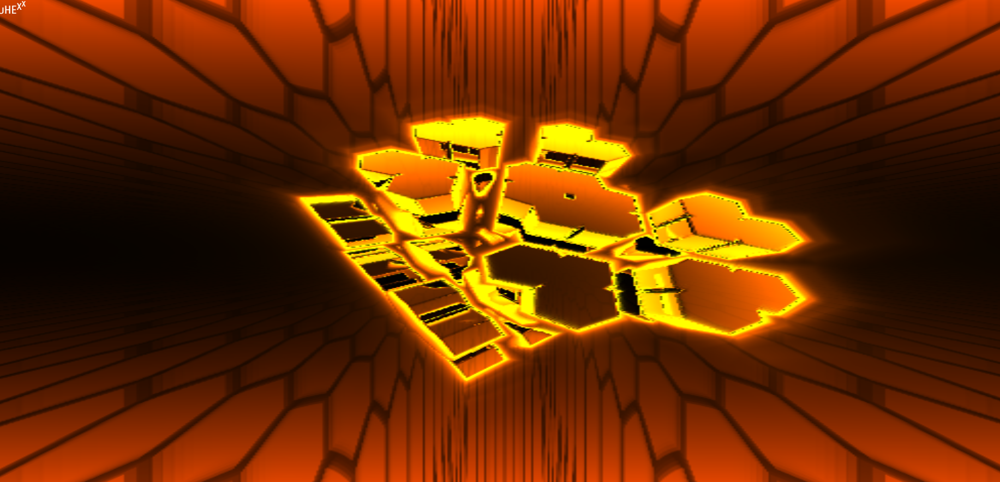

# Au-Hexx

> crazy monolith-like Webgl Demo for 4 DEV2108

[](http://devx.ddd.it/en/experiment/5 "A BLOB")

## Build Setup

``` bash
# install dependencies
npm i

# serve with hot reload at localhost:8080
npm run dev

# build for production
npm run build
```

## changelog

* 02/2018, first release for DEVX!!

* 04/2019, rebuild from scratch with new techniques acquired in the while. new features:
  - A lot GSL optimizations (many computations shifted in the vertex shader)
  - remove VueJS
  - built with TwglJS
  - FBO ping pong buffering
  - detect-gpu for sniffing, providing scalability choices
  - update deps with Webpack, etc
